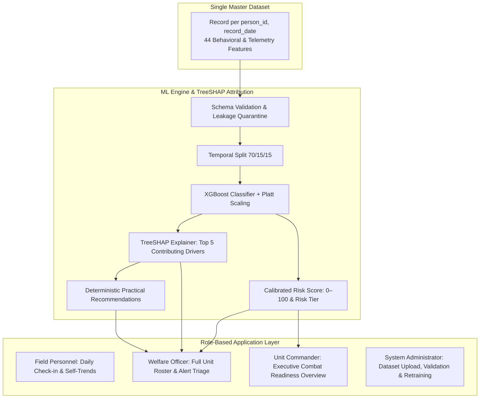

# Personnel Stress & Welfare Monitoring System — Comprehensive System Walkthrough

An early-warning welfare, stress-risk, and fatigue-monitoring intelligence platform built for operational forces (e.g. CAPF, defense, emergency responders). 

This document explains **the entire system architecture, machine learning pipeline, dataset structure, role-based workflows, and complete user walkthrough** in clear, concise terms for developers with introductory ML knowledge.

---

## 1. High-Level Architecture & Philosophy



### Key Principles:
1. **Early Warning over Crisis Management**: Detect fatigue and risk trajectories before they result in critical incidents.
2. **Stress vs. Welfare Risk**: 
   - **Observed Stress Score** (`1–10`): What the person currently reports or experiences.
   - **Predicted Welfare Risk Score** (`0–100`): What the calibrated ML model predicts regarding future 30-day welfare concerns (`welfare_concern_30d`).
3. **Privacy by Design**: Operational analytics and individual assessments strictly decouple identity (names, passwords) from analytical records via pseudonymous UUIDs.
4. **No Black-Box Predictions**: Every high score is backed by **TreeSHAP local feature explanations** and deterministic operational recommendations.

---

## 2. Tech Stack Summary

| Layer | Technology | Key Responsibility |
| :--- | :--- | :--- |
| **Frontend** | React 18, TypeScript, Vite, TailwindCSS | High-density defense console, role-based routing, Recharts visualizations |
| **Backend API** | FastAPI (Python 3.11), Uvicorn | REST endpoints, authentication (Argon2 + JWT), dataset upload/validation |
| **Machine Learning** | XGBoost, Scikit-learn, TreeSHAP, Pandas, OpenPyXL | Calibrated classifier, Platt scaling, local feature attribution, XLSX parsing |
| **Database** | PostgreSQL 15, SQLAlchemy, Alembic | Dual-schema relational isolation (`identity` vs. `analytics`) |
| **Containerization** | Docker Compose | Multi-container orchestration (DB, API, Frontend dev servers) |

---

## 3. The Single Master Dataset Schema

The system operates from a **Single Master Dataset** where each row represents:
$$\text{(person_id, record_date)}$$

The default baseline dataset contains **100 personnel across 10 weekly records = 1,000 observations**. The application dynamically supports any arbitrary number of personnel and rows.

### Column Categories:
1. **Identity & Demographics**: `person_id`, `record_date`, `age`, `experience_years`, `unit_id`, `role`, `role_difficulty_score`.
2. **Duty & Workload**: `duty_hours`, `overtime_hours`, `shift_type`, `night_shift`, `consecutive_work_days`, `consecutive_night_shifts`.
3. **Leave**: `leave_requested`, `leave_days`, `leave_type`, `leave_approved`, `days_since_last_leave`.
4. **Deployment & Transfer**: `deployment_status`, `deployment_duration_days`, `recent_deployment`, `transfer_event`, `days_since_transfer`, `deployment_hardship_score`.
5. **Wellness & Self-Report**: `sleep_hours`, `sleep_quality`, `mood_score`, `stress_score`, `fatigue_score`, `help_requested`.
6. **Derived Longitudinal Signals**: `avg_duty_hours_30d`, `night_shifts_30d`, `leave_days_30d`, `leave_requests_30d`, `leave_frequency`, `duty_hours_deviation`, `sleep_deviation`, `stress_deviation`, `mood_deviation`, `leave_deviation`, `night_shift_deviation`, `workload_deviation`, `wellness_trend`, `stress_trend`, `sleep_trend`.
7. **Training Target**: `welfare_concern_30d` (binary: 0 or 1).

> [!IMPORTANT]
> **Zero Data Leakage Rule**: Historical model outputs (`risk_probability`, `risk_score`, `risk_category`, `contributing_factors`, `factor_impacts`, `recommendations`, `model_version`, `prediction_timestamp`) are strictly quarantined and stripped out of the feature matrix during training. The model never trains on its own previous outputs.

---

## 4. Machine Learning & Explainability Pipeline

### Step 1: Feature Matrix Preparation
- Categorical features (`shift_type`, `leave_type`, `deployment_status`, `wellness_trend`, etc.) are ordinal or factor-encoded.
- Missing numeric values are imputed with dataset medians; missing categoricals default to neutral baselines.

### Step 2: Chronological / Temporal Split
- Rows are sorted strictly by `record_date`.
- Split sequentially into **Train (70%)**, **Validation (15%)**, and **Test (15%)**.
- **No future temporal leakage**: The model only learns from the past to predict future concerns.

### Step 3: XGBoost Training & Probability Calibration
- An **XGBoost Classifier** is trained with `scale_pos_weight` to account for class imbalance (welfare concern events are naturally less frequent).
- **Platt Scaling (`CalibratedClassifierCV`)**: Raw boosting outputs do not equate to true probabilities. A sigmoid Platt calibrator fitted on the temporal validation split ensures that an output probability of $0.75$ corresponds to an empirical 75% risk of concern.

### Step 4: 0–100 Operational Risk Scoring
The calibrated probability $P \in [0.0, 1.0]$ maps directly to an operational score:
$$\text{Risk Score} = \text{round}(P \times 100)$$

| Risk Category | Score Range | Operational Meaning |
| :--- | :--- | :--- |
| **LOW** | 0 – 34 | Nominal baseline readiness; continue standard check-ins |
| **MODERATE** | 35 – 64 | Steady operational load; monitor shift tempo |
| **HIGH** | 65 – 84 | Elevated fatigue indicators; proactive check-in warranted |
| **CRITICAL** | 85 – 100 | Immediate command/clinical attention; alert raised in triage queue |

### Step 5: TreeSHAP Feature Attribution
For every prediction, the model runs `shap.TreeExplainer` on the raw tree ensemble:
- Calculates the exact contribution of each feature towards or away from the prediction.
- Ranks features by **absolute SHAP magnitude** and returns the **Top 5**.
- Distinguishes direction:
  - **Positive Impact (+)**: Pushed the model toward *higher* welfare risk (e.g. `+35 pts`).
  - **Negative Impact (-)**: Pushed the model toward *lower* risk (e.g. `-18 pts`).
- Maps technical feature names to human-readable labels (e.g., `days_since_last_leave` $\to$ **Leave gap (days)**).

### Step 6: Deterministic Practical Recommendations
Based on the top SHAP drivers and risk tier, the engine generates actionable proposals with clear rationales:
- **Workload Review**: When duty hours or workload deviations dominate.
- **Review Night-Duty Schedule**: When night shift frequency or consecutive nights are elevated.
- **Wellness Check-in (Sleep & Recovery)**: When sleep quality or duration falls below personal baselines.
- **Review Leave Availability**: When prolonged leave gaps exceed thresholds.
- **Confidential Counseling Referral**: When acute stress spikes or voluntary help is requested.

---

## 5. Role-Based Access & User Walkthrough

The platform supports 4 distinct user roles:

| Role | Default Service Number | Password | Primary Route | Purpose |
| :--- | :--- | :--- | :--- | :--- |
| **Field Personnel** | `CAPF-2024-001` | `password123` | `/personnel` | Confidential self-check-in & personal wellness trends |
| **Welfare Officer** | `CAPF-2024-002` | `password456` | `/welfare` | Full personnel roster, SHAP drill-down & alert triage |
| **Unit Commander** | `COMM-001` | `command123` | `/commander` | Battalion combat readiness & workforce health metrics |
| **System Admin** | `ADMIN-001` | `admin123` | `/admin` | Dataset upload (CSV/XLSX), schema validation & retraining |

---

### Walkthrough Scenario 1: Field Personnel Self-Service
1. **Login**: Navigate to `/login` and select `CAPF-2024-001` via the quick-fill button.
2. **Personal Readiness Ledger (`/personnel`)**:
   - Inspect personal readiness tier (non-clinical, supportive language).
   - Review 30-day historical trends for Mood, Sleep, and Stress self-ratings.
3. **Daily Confidential Check-in (`/personnel/checkin`)**:
   - Submit daily sleep hours, sleep quality (1–5), mood rating (1–5), stress self-rating (1–10), and voluntary help requests.
   - All submissions are encrypted and linked solely to the user's `pseudonymous_id`.

---

### Walkthrough Scenario 2: Welfare Officer Roster & SHAP Inspection
1. **Login**: Select `CAPF-2024-002` (Welfare Officer).
2. **Unit Welfare Command (`/welfare`)**:
   - **Population Distribution Chart**: Visualizes proportion of personnel in Low, Moderate, High, and Critical tiers.
   - **Active Personnel Operational Roster**: Lists all monitored personnel from the master dataset.
   - View each individual's **Observed Stress** (`X / 10`) alongside **Welfare Risk** (`Y / 100`) and Risk Category badge.
   - Filter roster by Unit, Role, or Risk Category.
3. **Personnel Detailed View (`/welfare/personnel/:personId`)**:
   - Click on any person (e.g. `P0056` or `P0001`).
   - **Prominent Risk Score Gauge**: 0–100 circular indicator and risk tier.
   - **Why is this person's risk elevated? (TreeSHAP Attribution)**:
     - View the top 5 factors with horizontal visual bars.
     - Red/Amber bars: Factors pushing risk higher (+).
     - Green bars: Factors keeping risk lower (-).
     - Actual recorded values shown alongside population influence.
   - **Historical Trajectory (Longitudinal Chart)**: Multi-week line chart showing Stress Score, Welfare Risk, and Sleep Hours across historical record dates.
   - **Operational Detail Cards**: Categorized breakdowns for Current Wellness, Workload, Leave History, and Deployment/Transfer events.
   - **Actionable Recommendations**: Clear recommended actions paired with specific reasons derived from the top SHAP drivers.
4. **Alert Triage Queue (`/welfare/alerts`) & Case Review (`/welfare/cases/:id`)**:
   - Triage high/critical alerts and log formal supportive interventions (e.g. Mandatory Rest, Counseling Referral, Duty Reassignment).

---

### Walkthrough Scenario 3: Unit Commander Executive Overview
1. **Login**: Authenticate with commander credentials.
2. **Command Overview (`/commander`)**:
   - High-level combat readiness index and workforce health indicators.
   - Aggregated battalion metrics preserving individual confidentiality.

---

### Walkthrough Scenario 4: Admin Dataset Upload & Model Retraining
1. **Login**: Select `ADMIN-001` (System Administrator).
2. **Dataset Management Console (`/admin`)**:
   - **Live Status Card**: Inspect the active dataset name, model version (e.g. `synthetic-model-v1`), total rows, personnel count, and training timestamp.
3. **Upload New Dataset (CSV or Excel)**:
   - Select or drag-and-drop a new cohort file (`.csv`, `.xlsx`, or `.xls`).
   - Click **Upload & Validate**.
   - **Real-Time Validation Checklist**:
     - ✓ Required columns present (all 44 demographic, workload, leave, deployment, wellness fields)
     - ✓ Valid date formats
     - ✓ Zero duplicate `(person_id, record_date)` pairs
     - ✓ Numeric and target sanity checks
   - If columns are missing or dates malformed, explicit error banners indicate exact discrepancies.
4. **Train & Predict**:
   - Click **Train & Predict**.
   - Live step-by-step progress runner indicates:
     1. Dataset validated
     2. Features prepared & previous predictions excluded
     3. XGBoost model trained & calibrated via Platt scaling
     4. Personnel welfare risk predictions generated
     5. TreeSHAP explanations & recommendations computed
   - The model version increments (e.g. `model-v2`).
   - The active in-memory session updates immediately, refreshing all dashboard predictions and SHAP attributions without downtime.
5. **Session-Scoped Reboot Fallback**:
   - Uploaded datasets are active for the **current running session**.
   - When the backend container is restarted, the system automatically and cleanly reverts to the verified baseline `default_master_dataset.csv` and `synthetic-model-v1`.

---

## 6. Directory Structure & Key Files

```
hashItUp/
├── docker-compose.yml                     # Multi-container orchestration (db, backend, frontend)
├── personnel_stress_welfare_dataset 1.csv # Baseline Master Dataset (1,000 rows x 100 personnel)
├── backend/
│   ├── app/
│   │   ├── main.py                        # FastAPI entry point, CORS, lifespan initialization
│   │   ├── master_data.py                 # MasterDataManager: XGBoost, Platt scaling, TreeSHAP
│   │   ├── dataset_api.py                 # /api/dataset/* and /api/personnel/* REST endpoints
│   │   ├── auth.py                        # /auth/login JWT authentication & Argon2 hashing
│   │   ├── models.py                      # SQLAlchemy models for Identity and Analytics schemas
│   │   ├── risk_api.py                    # Legacy officer and personnel risk endpoints
│   │   ├── alerts_api.py                  # Triage queue and alert state management
│   │   └── interventions_api.py           # Formal officer supportive action logging
│   ├── data/
│   │   └── default_master_dataset.csv     # Default dataset loaded on container startup
│   └── requirements.txt                   # Backend dependencies (fastapi, xgboost, shap, openpyxl)
└── web/
    └── src/
        ├── App.tsx                        # Client-side router and role-based route protection
        ├── components/AppLayout.tsx       # Top operations header, role badges, navigation tabs
        ├── pages/Login.tsx                # Authentication screen with instant test quick-fills
        ├── pages/WelfareDashboard.tsx     # Macro risk distribution + full Personnel Roster table
        ├── pages/PersonnelDetailView.tsx  # Detail view: SHAP factor bars, trends, recommendations
        ├── pages/AdminDashboard.tsx       # Dataset upload (CSV/XLSX), validation & retraining
        └── pages/CommanderDashboard.tsx   # Battalion combat readiness executive dashboard
```

---

## 7. Verification & Testing Reference

All core pipelines have automated test coverage and live verification:
- **Startup Loading**: Verifies `default_master_dataset.csv` loads on startup, training `synthetic-model-v1`.
- **Roster & Detail API**: Validates `/api/personnel` lists all 100 personnel and `/api/personnel/{id}` returns top 5 TreeSHAP factors with proper sign attributions.
- **Upload & Retrain API**: Tested with CSV upload and `Train & Predict`, verifying in-memory activation of `model-v2`.
- **Schema Rejection**: Tested with missing-column CSV, verifying validation blocks training and returns descriptive error messages.
- **Restart Reset**: Verified container restart reverts active dataset back to `default_master_dataset.csv`.
