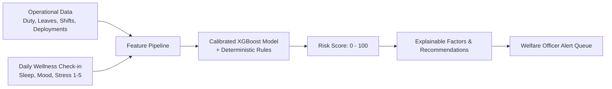

# Personnel Stress & Welfare Monitoring System — System Overview

An end-to-end welfare and stress-risk early-warning platform designed for high-stress operational personnel (e.g., defense, CAPF, emergency services).

---

## 1. The Core Idea

Instead of waiting for burnout, critical stress, or operational fatigue to cause severe breakdown, the system continuously aggregates **operational data** and **voluntary self-assessments** to detect early distress signals **without invading personal privacy**.



---

## 2. Tech Stack at a Glance

| Layer | Tech | Purpose |
| :--- | :--- | :--- |
| **Frontend** | React, TypeScript, Vite, Tailwind | Role-based dashboards (Personnel, Officer, Admin) |
| **Backend** | FastAPI (Python 3.11), Uvicorn | High-performance async REST API |
| **Database** | PostgreSQL 15, SQLAlchemy, Alembic | Dual-schema relational storage (`identity` vs `analytics`) |
| **ML / Analytics** | Scikit-learn, XGBoost, Pandas, Joblib | Calibrated risk scoring, SHAP-style factor attribution |
| **Infra** | Docker Compose | Multi-container orchestration (DB, API, Web) |

---

## 3. Machine Learning in Plain English

If you are comfortable with software development and have introductory ML knowledge, here is how the data science works under the hood:

### A. Feature Engineering (`app/features.py`)
Raw database events are transformed into behavioral signals across rolling windows (typically 4 weeks):
- **Workload**: Total duty hours, consecutive night shifts, irregular shift intervals.
- **Rest & Leave**: Days since last leave, leave utilization rate.
- **Self-Reported Trends**: Rolling trend in sleep quality, sudden drops in mood ($\ge 2$ drop), self-rating stress trends.

### B. Model Choice & Training (`app/train_model.py`)
- **Algorithm**: **XGBoost (Extreme Gradient Boosting)** with a **Logistic Regression** baseline.
- **Target**: Predicting likelihood of a welfare concern within the next 30 days (`welfare_concern_30d`).
- **Probability Calibration (Platt Scaling)**:
  - Raw ML models often output poorly calibrated raw probabilities.
  - The system fits `CalibratedClassifierCV` on a temporal validation split so that a predicted score of **0.80** actually corresponds to an **80% real-world likelihood**.
- **0–100 Operational Risk Score**:
  - Probability is mapped to an operational score (0–100) and banded into tiers:
    - **Low** ($< 35$)
    - **Moderate** ($35 - 64$)
    - **High** ($65 - 84$)
    - **Critical** ($\ge 85$)

### C. Explainability & Human-in-the-Loop (`app/explainability.py`)
Officers do not get a "black box" prediction. For every score, the model outputs **Top Contributing Factors** (e.g., *"3+ consecutive night shifts"*, *"Sudden mood drop of 2 points"*), along with deterministic clinical rules and recommended interventions (e.g., *Mandatory Rest Period*, *1-on-1 Counseling*).

---

## 4. Architecture & Key Architectural Decisions

### 1. Separation of Identity vs. Analytics (Privacy by Design)
The database enforces strict zero-knowledge segregation across two schemas:
- **`identity` schema**: Contains real service numbers, password hashes (Argon2), ranks, and names.
- **`analytics` schema**: All duties, check-ins, risk scores, and alerts link strictly to a random **`pseudonymous_id` (UUID)**.
- **Why?** Welfare officers triaging high-risk alerts only see pseudonymous risk files and behavioral indicators. Real identities cannot be casually browsed, preventing bias and stigmatization.

### 2. Role-Based Access Control (RBAC)
JWT tokens carry `role` claims that dictate view access:
- **`personnel`**: Can only submit their own confidential check-ins and view supportive, non-clinical wellbeing tips (`/personnel`).
- **`welfare_officer`**: Views aggregate unit analytics, triages high-risk alerts, and logs supportive interventions (`/welfare`).
- **`admin`**: System diagnostics, data synthesis, and migration maintenance (`/admin`).

### 3. Startup Lifespan & Resilience (`app/main.py`)
On boot, FastAPI executes:
1. **Alembic migrations** to guarantee table integrity.
2. **Auto-seeding** of the demo persona (`CAPF-2024-001`, `CAPF-2024-002`, `ADMIN-001`) if empty.
3. **Model loading (`model.joblib`)** cached in memory for sub-millisecond inference.

---

## 5. Directory Structure Quick Tour

```
hashItUp/
├── docker-compose.yml       # Orchestrates postgres, backend, frontend
├── backend/
│   ├── app/
│   │   ├── main.py          # FastAPI app factory, CORS, lifespan hook
│   │   ├── auth.py          # /auth/login JWT authentication
│   │   ├── models.py        # SQLAlchemy models (Identity & Analytics schemas)
│   │   ├── wellness.py      # Confidential check-in endpoints
│   │   ├── risk.py          # Risk scoring engine & pipeline execution
│   │   ├── train_model.py   # XGBoost training & Platt scaling script
│   │   ├── explainability.py# Translates features into human-readable reasons
│   │   └── model.joblib     # Persisted trained model artifact
│   └── data/synthetic/      # Demo data (duty, leave, wellness datasets)
└── web/
    └── src/
        ├── context/AuthContext.tsx # JWT session management & auth state
        ├── pages/Login.tsx         # Login page with demo quick-fills
        ├── pages/PersonnelDashboard.tsx # Self-service daily check-in
        └── pages/WelfareDashboard.tsx   # Officer alerts & case intervention view
```

---

## 6. Demo Flow Summary

1. **Login as Personnel (`CAPF-2024-001`)**: Baseline score is moderate. Personnel submits a distressed daily check-in (mood 1/5, stress 9/10).
2. **Instant Inference**: The backend extracts rolling features and passes them to the XGBoost pipeline. The score spikes into the **High Tier ($\ge 65$)**.
3. **Alert Triggered**: A new alert is raised in `analytics.alerts`.
4. **Login as Welfare Officer (`CAPF-2024-002`)**: The officer sees the high-severity alert, views the pseudonymized contributing factors, and records a supportive intervention (e.g., counseling / duty adjustment).
