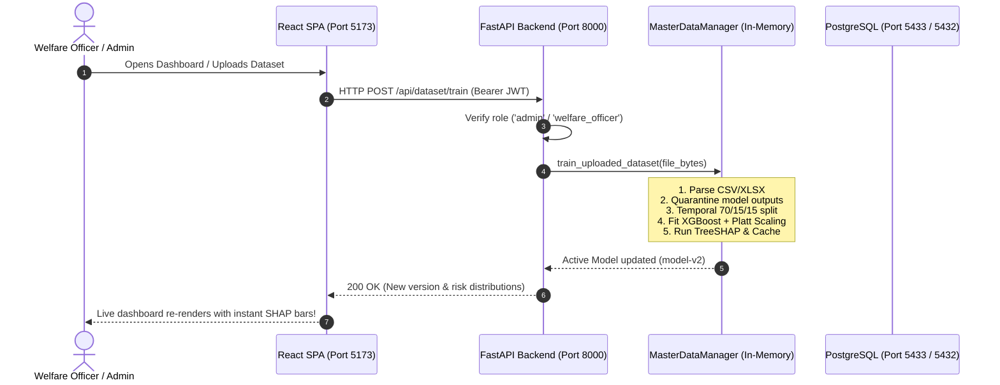

# TECHNICAL_ARCHITECTURE.md — System Internals & Behind-The-Scenes

Welcome to the technical engine room of the **Personnel Stress & Welfare Monitoring System**.

Think of this system as a specialized defense early-warning radar: instead of tracking airspace, it continuously monitors operational strain, duty tempo, and personal check-ins to detect burnout and distress before critical failure happens.

Here is the straightforward breakdown of the technology stack, how data moves across boundaries, and what actually executes under the hood.

---

## 1. The Core Stack at a Glance

| Layer | Technology | Why We Chose It |
| :--- | :--- | :--- |
| **Frontend UI** | **React 18 + Vite + TypeScript** | Sub-second HMR dev loop, strict typing across APIs, minimal client overhead. |
| **Styling & Theme** | **TailwindCSS (Tactical Slate Palette)** | Custom defense color palette (`field-bg`, `readiness-green`, `triage-amber`, `triage-red`). |
| **Data Visualization** | **Recharts** | Declarative SVG charts for macro risk distributions and multi-week longitudinal trajectories. |
| **Backend REST API** | **FastAPI (Python 3.11) + Uvicorn** | Asynchronous IO, auto-generating OpenAPI documentation, native Pydantic validation. |
| **Machine Learning** | **XGBoost + Scikit-Learn** | State-of-the-art tabular classification, handling collinear features and class imbalance smoothly. |
| **Explainable AI (XAI)**| **TreeSHAP (`shap.TreeExplainer`)** | Exact game-theoretic local feature attribution (calculating exact +/- points per driver in milliseconds). |
| **Relational Database**| **PostgreSQL 15 + SQLAlchemy 2.0** | ACID compliance, transactional migrations via **Alembic**, native multi-schema isolation. |
| **Security & Auth** | **Argon2id + PyJWT** | State-of-the-art password hashing + signed 8-hour stateless JWT bearer tokens. |
| **Infra & Deploy** | **Docker Compose** | Three isolated containers (`welfare_db`, `welfare_backend`, `welfare_frontend`) wired via internal bridge networking. |

---

## 2. Behind the Scenes: Data & Security Flow



---

## 3. Deep Dive: The Machine Learning Engine

### A. The Master Dataset Contract
The system consumes a single unified dataset where every record is indexed by:
$$\text{(person_id, record_date)}$$

It evaluates **44 behavioral and operational dimensions** across duty hours, night shifts, leave gaps, transfer events, deployment hardship, sleep hours, mood scores, and fatigue self-ratings.

### B. The Anti-Leakage Shield
A critical pitfall in real-world ML is data leakage. If a previous system already computed a `risk_score` or `risk_category` and left it in the CSV, a naive model would cheat by simply memorizing those outputs.

In [`backend/app/master_data.py`](file:///c:/Users/HP/Desktop/SIH%202026/hashItUp/backend/app/master_data.py):
```python
EXCLUDED_MODEL_OUTPUT_COLUMNS = {
    "risk_probability", "risk_score", "risk_category",
    "contributing_factors", "factor_impacts", "factor_directions",
    "recommendations", "recommendation_reasons",
    "model_version", "prediction_timestamp",
}
```
All such columns are automatically stripped prior to feeding feature arrays into NumPy / Pandas.

### C. Temporal Leakage-Safe Splitting
Because this is time-series cohort data, standard random $k$-fold cross-validation would cause future leakage (training on Week 8 to predict Week 2).
Instead, the pipeline performs **strictly chronological temporal partitioning**:
- **Train Split (70%)**: The earlier operational record dates.
- **Validation Split (15%)**: Middle period (used strictly for probability calibration).
- **Test Split (15%)**: Most recent time horizon.

### D. Why Platt Scaling Matters
Raw gradient-boosted trees output logit-like margin scores or uncalibrated sigmoid scores. A raw prediction of `0.80` does not mean an 80% real-world chance of crisis.
We wrap the XGBoost model in Platt Scaling:
```python
calibrated_model = CalibratedClassifierCV(
    estimator=FrozenEstimator(xgb_clf),
    method="sigmoid",
)
calibrated_model.fit(X_val, y_val)
```
This fits a logistic transformation over the validation predictions so the resulting `welfare_risk_score` (0–100) reflects a mathematically calibrated probability.

---

## 4. How TreeSHAP Works Behind the Scenes

When an officer inspects a soldier's profile (`/welfare/personnel/P0056`), they aren't looking at generic population statistics. They are looking at **local feature attribution**:

$$\text{Prediction}(x) = \phi_0 + \sum_{i=1}^{M} \phi_i$$

Where:
- $\phi_0$ is the base expected value across the entire cohort.
- $\phi_i$ is the exact mathematical contribution (in points) of feature $i$ toward or away from the welfare concern threshold.

```text
Feature Impact Visualization:
Sleep deviation from baseline  ████████████████ +35 pts  (Pushed risk HIGHER)
Leave gap (49 days)            ██████████       +20 pts  (Pushed risk HIGHER)
Deployment hardship (6.6)      █████████        -19 pts  (Pushed risk LOWER)
Mood drop (0.33)               ████████         +17 pts  (Pushed risk HIGHER)
```

Because we use `shap.TreeExplainer` on the raw tree structures, this calculation takes **under 2 milliseconds** per individual.

---

## 5. Privacy By Design: Dual-Schema Database Isolation

To guarantee that medical/welfare officers never confuse clinical welfare with disciplinary action or identity surveillance, PostgreSQL is split into two completely isolated schemas:

```
PostgreSQL Database: welfare_db
├── identity Schema  (Strict Zero-PII Boundary)
│   ├── identity.personnel  --> (service_number, password_hash, rank, name)
│   └── identity.user_roles --> (personnel, welfare_officer, commander, admin)
│
└── analytics Schema (De-Identified Telemetry)
    ├── analytics.duty_records         --> (pseudonymous_id, record_date, hours)
    ├── analytics.leave_records        --> (pseudonymous_id, start_date, days)
    ├── analytics.wellness_assessments --> (pseudonymous_id, mood, sleep, stress)
    ├── analytics.risk_scores          --> (pseudonymous_id, calibrated_score, SHAP)
    └── analytics.alerts               --> (pseudonymous_id, severity, status)
```

No database foreign key links `identity.personnel.service_number` to `analytics.duty_records.pseudonymous_id`. The application mediates role permissions via signed JWT claims.

---

## 6. Zero-Downtime Session Uploads with Clean Reboot Fallback

One of the coolest architectural decisions is how dataset uploads are handled:

1. **Admin Upload**: An admin uploads `new_cohort.xlsx` on `/admin`.
2. **In-Memory Hot Swap**: The backend parses, validates, and retrains the active model pipeline (`model-v2`) in RAM. The entire personnel roster and SHAP factors refresh immediately across all connected browsers.
3. **Reboot Cleanliness**: To prevent corrupting production or accumulating test bloat on disk, the system leaves `default_master_dataset.csv` untouched. Whenever the backend container reboots, it cleanly resets to the baseline `synthetic-model-v1`.

---

## 7. Fast Command Reference

```bash
# Start all containers in the background
docker compose up -d

# Check live backend API logs
docker logs -f welfare_backend

# Run production frontend build test
docker exec welfare_frontend npm run build

# Run master dataset training verification
docker exec welfare_backend python -c "from app.master_data import master_manager; print(master_manager.get_status())"
```
